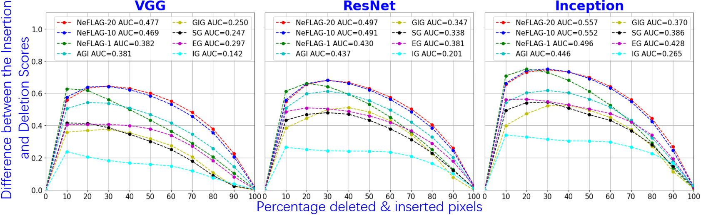

Overview
----
This repository is an implementation of the paper "[Negative Flux Aggregation to Estimate Feature Attributions](https://arxiv.org/pdf/2301.06989.pdf)".

Results
----
Qualitative Evaluation

<p></p>
<p></p>

Quantitative evaluation

citiation
----
If you find our work inspiring or use our codebase in your research, please consider giving a star ⭐ and a citation.

```
Xin Li, Deng Pan, Chengyin Li, Yao Qiang and Dongxiao Zhu
Negative Flux Aggregation to Estimate Feature Attributions, arxiv.2301.06989, 2023
https://github.com/xinli0928/NeFLAG/
```
```
@article{li2023negative,
  title={Negative Flux Aggregation to Estimate Feature Attributions},
  author={Li, Xin and Pan, Deng and Li, Chengyin and Qiang, Yao and Zhu, Dongxiao},
  journal={arXiv preprint arXiv:2301.06989},
  year={2023}
}
```

